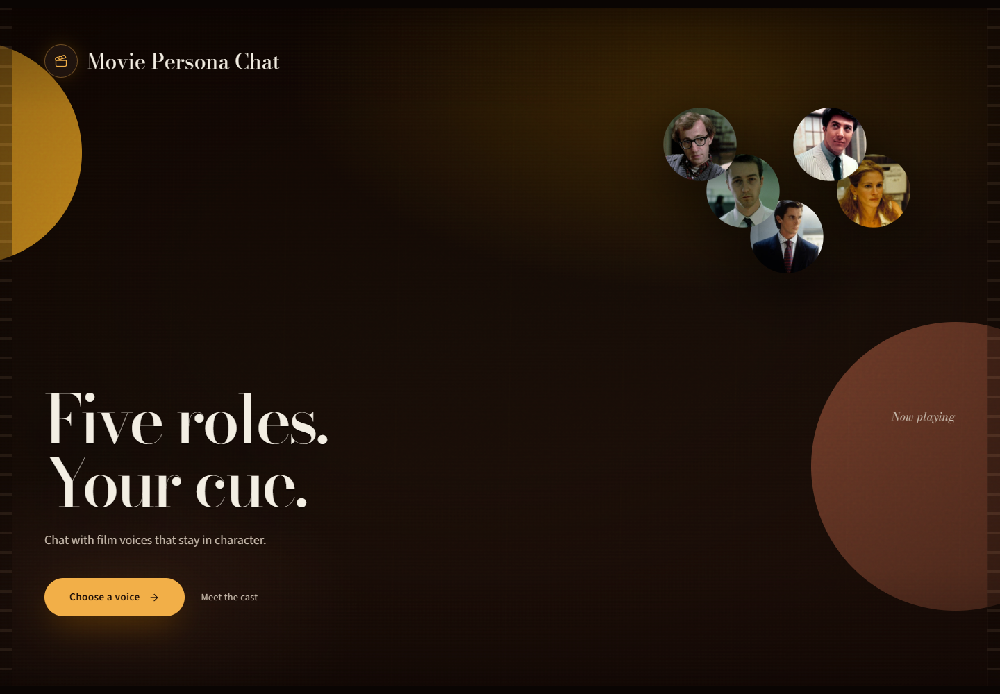

# Movie Persona Chat

<!-- markdownlint-disable MD033 -->
<div align="center">

**Five film voices. Your cue.**

A full-stack persona chat experience powered by a LoRA-tuned Qwen generator,
a RoBERTa persona classifier, and optional Best-of-N reranking.

[](https://web-nine-bice-uqkujgnxqk.vercel.app)
[](https://akaaaafk--movie-persona-api-fastapi-app.modal.run/docs)


[Live demo](https://web-nine-bice-uqkujgnxqk.vercel.app) ·
[Quick start](#local-setup) ·
[Docker](#docker) ·
[Training](#reproducing-training) ·
[Results](#evaluation-and-results) ·
[API](#api)

</div>
<!-- markdownlint-enable MD033 -->



> **Columbia COMS 5910 Deep Learning — Summer 2026 final project**

## At a glance

- **Five personas** from the Cornell Movie-Dialogs Corpus
- **Qwen2.5-1.5B + LoRA** for persona-conditioned response generation
- **RoBERTa classifier** for persona scoring and optional Best-of-N selection
- **React + FastAPI** application with conversation memory, microphone input,
  and streamed Edge TTS
- **Reproducible pipeline** covering data preparation, training, evaluation,
  local development, Docker, and cloud deployment

The hosted UI defaults to one candidate with reranking disabled to reduce
latency and compute cost. Local development keeps Best-of-N available.

## System overview

```text
User message + recent history + selected persona
                         |
                         v
       Qwen2.5-1.5B-Instruct + LoRA adapter
                         |
                 N candidate replies
                         |
                         v
           RoBERTa persona classifier
                         |
             Best-of-N selection (optional)
                         |
                         v
              React UI + optional Edge TTS
```

The five personas are:

| Tag | Character | Film |
| --- | --- | --- |
| `jack` | Jack / Narrator | *Fight Club* |
| `bateman` | Patrick Bateman | *American Psycho* |
| `alvy` | Alvy Singer | *Annie Hall* |
| `ben` | Benjamin Braddock | *The Graduate* |
| `erin` | Erin Brockovich | *Erin Brockovich* |

## What is included

| Component | Implementation | Required artifact |
| --- | --- | --- |
| Persona classifier | `persona_classifier/`, `scripts/train_classifier.py` | `models/classifier/model.safetensors` |
| Persona generator | `scripts/train_generator.py`, `inference.py` | `models/generator/adapter_model.safetensors` |
| Best-of-N reranker | `PersonaPipeline.chat()` in `inference.py` | Classifier + generator artifacts |
| API | `api_server.py` (FastAPI) | Same model artifacts |
| Web client | `web/` (React, Vite, TypeScript) | None |
| Speech output | `tts_edge.py` (`edge-tts`) | Internet access; no local voice weights |
| Evaluation | `scripts/evaluate_bon_rerank.py` | Same model artifacts |

The generator directory contains a **LoRA adapter**, not the full Qwen model.
At first use, Transformers downloads the base
`Qwen/Qwen2.5-1.5B-Instruct` checkpoint and caches it locally.

## Repository layout

```text
final_project/
├── api_server.py                    # FastAPI endpoints
├── inference.py                     # generation, grounding, and reranking
├── tts_edge.py                      # streamed Edge TTS
├── modal_app.py                     # optional Modal deployment
├── Dockerfile                       # portable API container
├── requirements.txt                 # training + evaluation + serving
├── requirements-space.txt           # lean API/container dependencies
├── persona_classifier/              # classifier inference interface
├── scripts/
│   ├── download_data.py
│   ├── preprocess.py
│   ├── generate_hard_negatives.py
│   ├── train_classifier.py
│   ├── build_training_pairs.py
│   ├── train_generator.py
│   └── evaluate_bon_rerank.py
├── notebooks/                       # original exploratory/training notebooks
├── data/
│   ├── raw/                         # downloaded Cornell corpus (gitignored)
│   └── processed/                   # selected personas and derived datasets
├── models/
│   ├── classifier/                  # RoBERTa checkpoint
│   └── generator/                   # Qwen LoRA adapter
├── results/                         # classifier and reranking evaluations
└── web/                             # React client
```

## Do I need to retrain?

No, not to run the finished application. If these two files are present, the
trained pipeline is ready:

```text
models/classifier/model.safetensors
models/generator/adapter_model.safetensors
```

Retraining is only needed to reproduce the experiments, change personas, or
produce new weights. The classifier checkpoint is large and may not be present
in a fresh Git clone because model artifacts are normally excluded from Git.
Copy or download both artifacts into the paths above before running the API or
building the Docker image.

## Local setup

### Prerequisites

- Python 3.11 or 3.12
- Node.js 20+
- Approximately 8 GB of free disk space for dependencies, weights, and the
  cached Qwen base model
- NVIDIA GPU recommended; CPU inference works but is slow

### 1. Python environment

From `final_project/`:

```bash
python -m venv .venv
```

Windows PowerShell:

```powershell
.\.venv\Scripts\Activate.ps1
python -m pip install --upgrade pip
python -m pip install -r requirements.txt
```

macOS/Linux:

```bash
source .venv/bin/activate
python -m pip install --upgrade pip
python -m pip install -r requirements.txt
```

For an NVIDIA system, install the PyTorch build appropriate for the installed
driver. This project was tested locally with CUDA 13:

```bash
python -m pip install --upgrade torch torchvision \
  --index-url https://download.pytorch.org/whl/cu130
```

Verify acceleration:

```bash
python -c "import torch; print(torch.__version__, torch.cuda.is_available(), torch.cuda.get_device_name(0) if torch.cuda.is_available() else 'CPU')"
```

### 2. Start the API

```bash
python api_server.py
```

The API runs at `http://127.0.0.1:8000`. The first model load can take several
minutes while the base Qwen checkpoint is downloaded.

Smoke test:

```bash
curl http://127.0.0.1:8000/api/health
```

### 3. Start the web client

In another terminal:

```bash
cd web
npm install
npm run dev
```

Open `http://localhost:5173`. Vite proxies `/api` to the local FastAPI server.
To use a remote backend, copy `web/.env.example` to `web/.env` and set
`VITE_API_BASE`.

### Command-line generation

```bash
python inference.py --character jack \
  --prompt "What do you think about modern life?" --n 3 --all
```

## Docker

The root Dockerfile builds the React client and packages it with the API and
model artifacts. One container therefore serves the complete application:

- UI: `http://localhost:8000`
- API docs: `http://localhost:8000/docs`
- Health: `http://localhost:8000/api/health`

The build intentionally fails if either trained artifact is missing, preventing
an accidental deployment with the classifier stub or untuned base generator.

### Portable CPU image

```bash
docker build -t movie-persona-api .
docker run --rm -p 8000:8000 \
  -v movie-persona-hf-cache:/home/app/.cache/huggingface \
  movie-persona-api
```

### NVIDIA GPU image

The host needs a compatible NVIDIA driver and NVIDIA Container Toolkit:

```bash
docker build \
  --build-arg TORCH_INDEX_URL=https://download.pytorch.org/whl/cu130 \
  -t movie-persona-api:cuda .

docker run --rm --gpus all -p 8000:8000 \
  -v movie-persona-hf-cache:/home/app/.cache/huggingface \
  movie-persona-api:cuda
```

Useful environment variables:

| Variable | Default | Purpose |
| --- | --- | --- |
| `PORT` | `8000` | Container API port |
| `PRELOAD_PIPELINE` | `0` | Set to `1` to load models during startup |
| `CORS_ORIGINS` | local Vite origins | Comma-separated allowed UI origins |
| `HF_TOKEN` | unset | Optional Hugging Face token |

After startup:

```bash
curl http://localhost:8000/api/health
```

Then open `http://localhost:8000` in a browser.

## Reproducing training

The project uses the Cornell Movie-Dialogs Corpus. Raw and most processed data
are intentionally gitignored.

### Data preparation

```bash
python scripts/download_data.py
python scripts/preprocess.py
```

`notebooks/Data_Prep.ipynb` documents the original persona-selection and
train/validation/test split process. The finished repository already contains
the selected-persona metadata and classifier splits used for this project.

### Classifier

```bash
# Optional: requires ANTHROPIC_API_KEY and creates hard-negative rewrites
python scripts/generate_hard_negatives.py

# Real dialogue + hard negatives when available
python scripts/train_classifier.py

# Real-dialogue ablation
python scripts/train_classifier.py --no-synthetic
```

The classifier is saved to `models/classifier/`; metrics are written to
`results/`.

### Generator

```bash
python scripts/build_training_pairs.py
python scripts/train_generator.py
```

The first command pairs a selected character's response with the preceding
line in each Cornell conversation. The second LoRA-fine-tunes
Qwen2.5-1.5B-Instruct and writes the adapter to `models/generator/`.

## Evaluation and results

Classifier test performance with synthetic hard negatives:

- Accuracy: **0.587**
- Macro-F1: **0.577**

Best-of-N versus plain LoRA was evaluated on 120 paired generations
(5 personas × 8 prompts × 3 random seeds, `N=3`):

| Metric | Plain LoRA | Best-of-N | Difference |
| --- | ---: | ---: | ---: |
| Mean classifier probability for target persona | 0.213 | 0.422 | **+0.209** |
| Mean local LLM judge score (1–5) | 2.050 | 2.217 | **+0.167** |

The classifier metric improves strongly, but that comparison is partly
circular because the same classifier selects the Best-of-N output. The local
LLM judge (base Qwen2.5-1.5B with the persona LoRA disabled) found only a small
gain with many ties. Therefore, the evidence supports a clear improvement in
the reranker's own score, but **not a strong or reliable independent
persona-consistency improvement**.

Reproduce the comparison:

```bash
python scripts/evaluate_bon_rerank.py --n 3 --seeds 42 43 44
```

Detailed outputs:

- `results/persona_classifier_metrics.json`
- `results/persona_classifier_no_synthetic_metrics.json`
- `results/bon_vs_plain_eval.json`
- `results/bon_vs_plain_eval.md`

## API

| Method | Route | Purpose |
| --- | --- | --- |
| `GET` | `/api/health` | Service, model-load, persona, and TTS status |
| `GET` | `/api/characters` | Persona metadata |
| `POST` | `/api/chat` | Generate a reply, optionally with Best-of-N |
| `POST` | `/api/tts` | Stream an `audio/mpeg` response |

Example:

```bash
curl -X POST http://127.0.0.1:8000/api/chat \
  -H "Content-Type: application/json" \
  -d "{\"message\":\"How is your day going?\",\"character\":\"alvy\",\"n_candidates\":3,\"use_rerank\":true,\"history\":[]}"
```

## Deployment

- `modal_app.py` deploys the FastAPI backend to Modal.
- `web/vercel.json` and `VITE_API_BASE` support deploying the React client to
  Vercel.
- `DEPLOY.md` contains the current hosted deployment procedure.
- The Dockerfile can be used on any container host that provides enough memory
  and permits downloading the Qwen base model.

## Limitations

- The persona classifier has moderate held-out accuracy, so maximizing its
  score does not guarantee that humans or another LLM will prefer the result.
- Best-of-N increases latency and compute approximately with the number of
  candidates.
- The independent judge used in the included evaluation is a small local model,
  not a human evaluation or a large external judge.
- Identity questions use deterministic grounding rules; they should not be
  interpreted as evidence of learned persona behavior.
- Edge TTS voices are synthetic and are not licensed actor voice likenesses.

## Data and model notes

The Cornell Movie-Dialogs Corpus remains subject to its original terms. The
project is intended for coursework and research. Movie character names belong
to their respective rights holders; generated avatars and voices are not
official or licensed representations.
